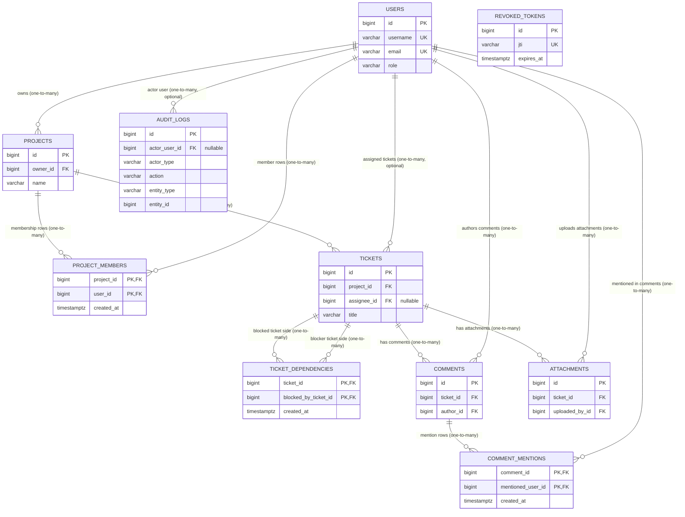

# Database Relationships (Current Schema)

This diagram is based on the **actual Flyway migrations** (`V1__baseline.sql`, `V3__project_members.sql`) and verified against the current JPA entities.

## Mermaid ERD

## Diagram Image

## Relationship Types and Explanations

- **`users` -> `projects` (one-to-many):** one user can own many projects; each project has exactly one owner (`projects.owner_id`).
- **`projects` -> `tickets` (one-to-many):** one project contains many tickets; each ticket belongs to exactly one project (`tickets.project_id`).
- **`users` -> `tickets` (one-to-many via assignee, optional):** one user can be assigned many tickets; a ticket may also be unassigned (`tickets.assignee_id` is nullable).
- **`projects` <-> `users` (many-to-many through `project_members`):** membership is implemented with join table `project_members(project_id, user_id)`.
- **`tickets` -> `comments` (one-to-many):** one ticket can have many comments; each comment belongs to one ticket (`comments.ticket_id`).
- **`users` -> `comments` (one-to-many):** one user can author many comments; each comment has one author (`comments.author_id`).
- **`comments` <-> `users` (many-to-many through `comment_mentions`):** mention links are stored in `comment_mentions(comment_id, mentioned_user_id)`.
- **`tickets` -> `attachments` (one-to-many):** one ticket can have many attachments; each attachment belongs to one ticket (`attachments.ticket_id`).
- **`users` -> `attachments` (one-to-many):** one user can upload many attachments; each attachment has one uploader (`attachments.uploaded_by_id`).
- **`users` -> `audit_logs` (one-to-many, optional):** an audit log may reference a user actor (`audit_logs.actor_user_id`) or be system-generated (`actor_user_id` is nullable).
- **`tickets` <-> `tickets` (many-to-many self-reference through `ticket_dependencies`):** dependencies between tickets are stored as join rows in `ticket_dependencies(ticket_id, blocked_by_ticket_id)`.
- **`revoked_tokens` has no FK relationships:** token revocation records are standalone in current schema.

## Notes

- For many-to-many relationships, the join tables (`project_members`, `comment_mentions`, `ticket_dependencies`) are shown explicitly.
