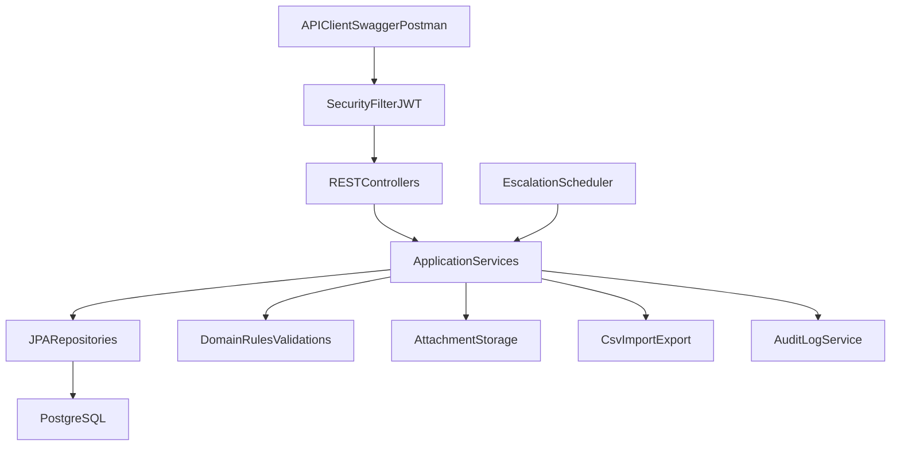

# IssueFlow Spring Boot Implementation Plan

## 1) Assignment Understanding (What exists now)

You need to build a full REST backend for IssueFlow (users, auth, projects, tickets, comments, audit logs, dependencies, attachments, CSV import/export, soft delete/restore, mentions, auto-escalation, auto-assignment/workload) in Java + Spring Boot.

Current skeleton status is intentionally minimal:

- App bootstrap exists: [`c:/Users/vered/CursorProjects/issueflow-java/src/main/java/com/att/tdp/issueflow/IssueFlowApplication.java`](c:/Users/vered/CursorProjects/issueflow-java/src/main/java/com/att/tdp/issueflow/IssueFlowApplication.java)
- DB wiring exists in config: [`c:/Users/vered/CursorProjects/issueflow-java/src/main/resources/application.yaml`](c:/Users/vered/CursorProjects/issueflow-java/src/main/resources/application.yaml)
- Docker Postgres service exists: [`c:/Users/vered/CursorProjects/issueflow-java/compose.yml`](c:/Users/vered/CursorProjects/issueflow-java/compose.yml)
- Domain implementation is not present yet (no entities/controllers/services/repositories)
- Existing SQL seed/schema files are placeholder and unrelated to assignment domain (`task` table)

## 2) Source-of-Truth and Contradictions

### What to follow

- The PDF explicitly says: use the API table in README as implementation contract.
- Therefore, **API paths/contracts in README should be treated as primary for endpoint shape**, while **business rules/constraints in PDF are mandatory behavior**.

### Notable mismatches / unclear points

- **Project/Ticket delete semantics**:
  - README already defines soft-delete APIs and says hard delete is not exposed.
  - PDF section 2 says "Delete" for project/ticket, while section 3.5 clarifies soft-delete only.
  - **Decision**: implement soft-delete only.
- **User update endpoint**:
  - README uses `POST /users/update/:userId` (non-REST style), while most others use PATCH.
  - PDF only says update user details, not exact path.
  - **Decision**: implement exactly as README contract, optionally add PATCH alias only if you want compatibility.
- **Auth table in README has a formatting gap for `/auth/me` response body**.
  - PDF clarifies it returns current user profile.
  - **Decision**: return standard user DTO for authenticated principal.
- **Concurrent update rule appears in PDF (tickets/comments), not detailed in README**.
  - **Decision**: enforce optimistic locking (`@Version`) for ticket/comment entities.

## 3) Main Requirements Extracted

- JWT auth for all endpoints (`/auth/login`, `/auth/logout`, `/auth/me`)
- RBAC with at least `ADMIN`, `DEVELOPER`
- CRUD + listing for users/projects/tickets/comments
- Ticket lifecycle and business rules:
  - valid enum values
  - forward-only status transitions
  - no updates once DONE
  - cannot set DONE with unresolved dependencies
- Audit log for all state-changing actions (user or system actor)
- Ticket dependencies (same-project constraint)
- Attachments with size/type validation (10 MB, allowed MIME list)
- CSV export/import for tickets with robust parsing
- Soft delete + restore (projects/tickets), admin-only listing/restoration
- Mentions parsing in comments (case-insensitive username matching), re-evaluated on update
- Auto-escalation scheduler (dueDate -> priority promotion and `isOverdue` behavior)
- Auto-assignment on ticket creation without assignee using least workload developer + tie-break by registration order
- Workload endpoint per project sorted ascending by open ticket count
- Input validation, clear error responses, and relevant tests
- Documentation files required: `run.md`, `prompts.md` (including model used and AI process artifacts)

## 4) Recommended Architecture (Why it fits)

Use a **layered modular monolith**:

- Controllers (API contract layer)
- Services (business rules + orchestration)
- Repositories (JPA persistence)
- Domain entities + value enums
- Infra/security/scheduling/storage modules

Why this is best for a home assignment:

- Simple enough to explain end-to-end
- Keeps business rules centralized and testable
- Avoids over-engineering (no microservices/event buses needed)
- Natural fit for Spring Boot + JPA + JWT

## 5) Recommended Package Structure

Under `com.att.tdp.issueflow`:

- `common`
  - `exception` (custom exceptions, global handler)
  - `api` (error response model, paging wrappers)
  - `validation` (shared validators)
  - `mapper` (MapStruct/manual mappers)
- `security`
  - `config` (Spring Security config)
  - `jwt` (token provider/filter)
  - `auth` (login/logout/me DTOs/service)
- `user` (`controller`, `service`, `repository`, `entity`, `dto`)
- `project` (same layering)
- `ticket` (same layering + `scheduler`, `csv`, `dependency`, `workload` subpackages)
- `comment` (includes mention extraction integration)
- `attachment` (storage strategy + metadata)
- `audit` (append-only logs)

Resource layout:

- `src/main/resources/application.yaml` (+ profile files)
- `src/main/resources/db/migration` (Flyway scripts)

## 6) Phased Implementation Plan

### Phase 0: Foundation & Project Hygiene

- **Do**:
  - Add missing dependencies: security, JWT lib, OpenAPI, Flyway (and test helpers if needed)
  - Replace placeholder SQL (`task`) with proper migration approach
  - Configure profiles (`local`, `test`) cleanly
- **Affects**:
  - [`c:/Users/vered/CursorProjects/issueflow-java/pom.xml`](c:/Users/vered/CursorProjects/issueflow-java/pom.xml)
  - [`c:/Users/vered/CursorProjects/issueflow-java/src/main/resources/application.yaml`](c:/Users/vered/CursorProjects/issueflow-java/src/main/resources/application.yaml)
  - [`c:/Users/vered/CursorProjects/issueflow-java/src/test/resources/application.yaml`](c:/Users/vered/CursorProjects/issueflow-java/src/test/resources/application.yaml)
  - SQL/migration files under `src/main/resources`
- **Outcome**:
  - Clean bootstrapping baseline ready for domain implementation

### Phase 1: Domain Model + Persistence

- **Do**:
  - Create entities/tables: User, Project, Ticket, Comment, Dependency, Attachment, Mention, AuditLog, token deny-list (if stateful logout)
  - Add enums and `@Version` fields for optimistic locking
  - Define repository interfaces and essential query methods
- **Affects**:
  - New packages in `src/main/java/com/att/tdp/issueflow/**`
  - Flyway migration scripts
- **Outcome**:
  - Stable persistence backbone and schema aligned with business rules

### Phase 2: Security & Auth

- **Do**:
  - Implement JWT issuing/validation and security filter chain
  - Add `/auth/login`, `/auth/logout`, `/auth/me`
  - Wire role-based authorization (ADMIN vs DEVELOPER)
- **Affects**:
  - `security/*`, auth controller/service, user integration
- **Outcome**:
  - Protected API with predictable auth behavior

### Phase 3: Core CRUD APIs (Users/Projects/Tickets/Comments)

- **Do**:
  - Implement contract endpoints from README
  - Enforce all core validations + ticket status progression + DONE immutability
  - Record audit entries on create/update/delete/restore/system actions
- **Affects**:
  - domain module controllers/services/repositories, exception handler
- **Outcome**:
  - Working baseline system with core operations and consistent errors

### Phase 4: Extended Features

- **Do**:
  - Dependencies API + “cannot DONE if blockers unresolved”
  - Attachment upload/delete with MIME/size validation
  - CSV export/import with robust quote/comma handling
  - Soft-delete listings/restore admin-only
  - Mentions extraction and mentions endpoint
  - Workload endpoint + auto-assignment logic
- **Affects**:
  - ticket/comment/project/attachment/audit modules
- **Outcome**:
  - Full functional parity with assignment extended requirements

### Phase 5: Scheduler + System Automation

- **Do**:
  - Implement periodic escalation job for overdue tickets
  - Ensure idempotent escalation semantics and reset behavior after manual priority updates
  - Emit SYSTEM audit records for escalations and auto-assignments
- **Affects**:
  - ticket scheduler/service/audit integration
- **Outcome**:
  - Time-based behavior completed and auditable

### Phase 6: Documentation + Final Hardening

- **Do**:
  - Add OpenAPI/Swagger annotations and grouped docs
  - Write `run.md` exact setup/build/run/test instructions
  - Write `prompts.md` with AI usage + model + key prompts and artifacts
  - Final pass on errors, naming consistency, and API examples
- **Affects**:
  - controllers/DTO annotations, root docs files
- **Outcome**:
  - Submission-ready repository with clear operation and traceability

## 7) Critical Implementation Attention Points

- **Business rules**:
  - enforce ticket state machine in service layer (single source of truth)
  - block DONE when unresolved dependencies exist
- **Validation**:
  - Bean Validation on DTOs + custom validators for cross-field checks
- **Authorization**:
  - admin-only operations for deleted listing/restore
  - authenticated access to all protected endpoints
- **Error handling**:
  - centralized `@RestControllerAdvice` returning consistent payload (`code`, `message`, `details`)
- **Concurrency**:
  - optimistic locking for ticket/comment updates to satisfy "can’t edit simultaneously"
- **Persistence**:
  - prefer Flyway migrations over ad-hoc `schema.sql`/`data.sql`
- **Auditability**:
  - append-only audit table; never mutate historical rows

## 8) Swagger / OpenAPI Recommendation

- Add `springdoc-openapi-starter-webmvc-ui`
- Expose `/swagger-ui.html` and `/v3/api-docs`
- Add global Bearer JWT security scheme so protected endpoints are testable directly in Swagger UI
- Document enums, error responses, and multipart endpoints (`tickets/import`, attachments)
- Add concise operation summaries matching README contracts

## 9) `prompts.md` Recommendation (AI usage compliance)

Create `prompts.md` with:

- model used (exact model name)
- purpose of each major prompt (design, bug fixing, tests, docs)
- key prompts + short outcomes (not every trivial iteration)
- list of generated/assisted artifacts (plan, instructions, skills used)
- a short “human verification” note describing what you personally reviewed/validated

Suggested sections:

- `Model`
- `Prompt Log`
- `AI-Assisted Changes`
- `Manual Verification`

## 10) Testing Strategy and Stage Placement

- **Phase 1–2**:
  - repository tests (queries, soft-delete filters)
  - auth unit/integration tests (token issuance/validation, unauthorized access)
- **Phase 3**:
  - controller integration tests for users/projects/tickets/comments happy + validation/error paths
  - status transition tests, DONE immutability, optimistic lock conflict tests
- **Phase 4**:
  - dependencies constraints tests
  - attachment constraints tests (MIME/size)
  - CSV import/export tests including quotes/commas edge cases
  - mentions parsing/update delta tests
  - workload sorting + auto-assignment tie-break tests
- **Phase 5**:
  - scheduler behavior tests (overdue escalation progression/idempotency/reset)
  - system audit log generation tests
- **Final gate**:
  - end-to-end smoke flow: auth -> create project -> create/update tickets/comments -> export/import -> soft delete/restore

## 11) Gaps / Risks in Existing Skeleton (Critical Review)

- Missing security dependencies/configuration for JWT auth
- Missing OpenAPI dependency/configuration
- Placeholder `schema.sql`/`data.sql` conflict with actual domain (currently a `task` table)
- `src` has no domain code yet (expected but significant scope)
- Test config has suspicious `spring.sql.init.platform: mssql` despite H2/Postgres context; should be corrected
- `compose.yml` is minimal (good for assignment) but no healthcheck/volume by default

## 12) Recommended Build Order (Practical)

Start with: schema + entities + auth + users/projects/tickets/comments + global errors + tests.
Then complete: dependencies/attachments/import-export/mentions/workload.
Finally: scheduler, docs (`run.md`, `prompts.md`), and polish.
