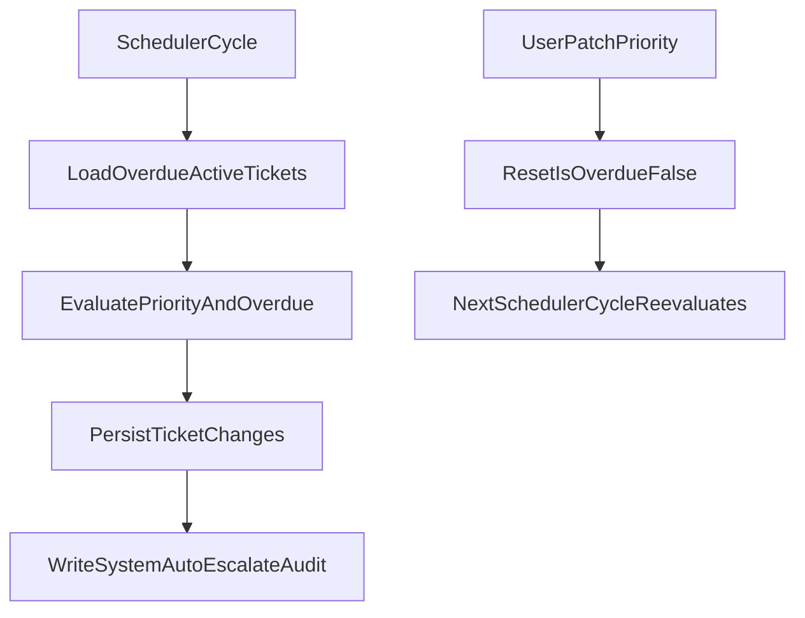

# Phase 5 Plan: Scheduler + System Automation

## Goal

Implement the overdue escalation automation end-to-end so tickets with `dueDate` are escalated predictably, idempotently, and auditable, while preserving existing API behavior.

## Current State (from code)

- `Ticket` already contains `dueDate` and `isOverdue` fields: [c:/Users/vered/CursorProjects/issueflow-java/src/main/java/com/att/tdp/issueflow/ticket/entity/Ticket.java](c:/Users/vered/CursorProjects/issueflow-java/src/main/java/com/att/tdp/issueflow/ticket/entity/Ticket.java)
- `TicketService` already logs `AUTO_ASSIGN` and supports priority updates, but does **not** reset `isOverdue` on manual priority change yet: [c:/Users/vered/CursorProjects/issueflow-java/src/main/java/com/att/tdp/issueflow/ticket/TicketService.java](c:/Users/vered/CursorProjects/issueflow-java/src/main/java/com/att/tdp/issueflow/ticket/TicketService.java)
- `AuditAction.AUTO_ESCALATE` exists, but no scheduler uses it: [c:/Users/vered/CursorProjects/issueflow-java/src/main/java/com/att/tdp/issueflow/audit/enums/AuditAction.java](c:/Users/vered/CursorProjects/issueflow-java/src/main/java/com/att/tdp/issueflow/audit/enums/AuditAction.java)
- `ticket/scheduler` package exists only as placeholder (`package-info.java`): [c:/Users/vered/CursorProjects/issueflow-java/src/main/java/com/att/tdp/issueflow/ticket/scheduler/package-info.java](c:/Users/vered/CursorProjects/issueflow-java/src/main/java/com/att/tdp/issueflow/ticket/scheduler/package-info.java)
- `IssueFlowApplication` has no scheduling enabled yet: [c:/Users/vered/CursorProjects/issueflow-java/src/main/java/com/att/tdp/issueflow/IssueFlowApplication.java](c:/Users/vered/CursorProjects/issueflow-java/src/main/java/com/att/tdp/issueflow/IssueFlowApplication.java)
- Existing integration tests cover Phase 4 but there is no escalation test suite: [c:/Users/vered/CursorProjects/issueflow-java/src/test/java/com/att/tdp/issueflow/integration/extended](c:/Users/vered/CursorProjects/issueflow-java/src/test/java/com/att/tdp/issueflow/integration/extended)

## Implementation Plan

### 1) Add scheduler configuration surface

- Add `issueflow.ticket.escalation` properties in:
  - [c:/Users/vered/CursorProjects/issueflow-java/src/main/resources/application.yaml](c:/Users/vered/CursorProjects/issueflow-java/src/main/resources/application.yaml)
  - [c:/Users/vered/CursorProjects/issueflow-java/src/test/resources/application.yaml](c:/Users/vered/CursorProjects/issueflow-java/src/test/resources/application.yaml)
- Include:
  - `enabled` (boolean toggle)
  - `fixed-delay-ms` (or cron expression; pick one mechanism and keep consistent)
  - optional `batch-size` to avoid scanning too many rows in one run.
- Enable scheduling in app bootstrap (`@EnableScheduling`) in:
  - [c:/Users/vered/CursorProjects/issueflow-java/src/main/java/com/att/tdp/issueflow/IssueFlowApplication.java](c:/Users/vered/CursorProjects/issueflow-java/src/main/java/com/att/tdp/issueflow/IssueFlowApplication.java)

### 2) Add repository query support for escalation candidates

- Extend [c:/Users/vered/CursorProjects/issueflow-java/src/main/java/com/att/tdp/issueflow/ticket/repository/TicketRepository.java](c:/Users/vered/CursorProjects/issueflow-java/src/main/java/com/att/tdp/issueflow/ticket/repository/TicketRepository.java) with targeted methods for active overdue candidates:
  - due date set and `< now`
  - not soft-deleted
  - not `DONE`
- Keep query explicit and deterministic (ordered by `id` or `dueDate`) to make behavior testable.

### 3) Implement escalation engine in scheduler package

- Add a dedicated class (e.g., `TicketEscalationScheduler`) under:
  - [c:/Users/vered/CursorProjects/issueflow-java/src/main/java/com/att/tdp/issueflow/ticket/scheduler](c:/Users/vered/CursorProjects/issueflow-java/src/main/java/com/att/tdp/issueflow/ticket/scheduler)
- Responsibilities per cycle:
  - Fetch escalation candidates.
  - Apply one-step priority promotion per run (`LOW->MEDIUM->HIGH->CRITICAL`).
  - If already `CRITICAL` and still overdue, set `isOverdue=true`.
  - Never modify `status`.
  - Persist only changed tickets.
  - Emit `AuditAction.AUTO_ESCALATE` with `AuditActorType.SYSTEM` via `AuditService.recordSystemAction(...)`.
- Add small private helper for next-priority mapping to keep rules centralized and readable.

### 4) Wire manual reset behavior in ticket update flow

- Update [c:/Users/vered/CursorProjects/issueflow-java/src/main/java/com/att/tdp/issueflow/ticket/TicketService.java](c:/Users/vered/CursorProjects/issueflow-java/src/main/java/com/att/tdp/issueflow/ticket/TicketService.java):
  - When user sends manual `priority` in `PATCH /tickets/{id}`, always clear `isOverdue=false` (requirement: manual priority change resets auto-escalation state).
  - Keep existing user audit entry (`UPDATE`) untouched.
  - Do not auto-escalate inside patch request itself; scheduler remains the only escalation trigger.

### 5) Add Phase 5 integration tests

- Create a dedicated test class in:
  - [c:/Users/vered/CursorProjects/issueflow-java/src/test/java/com/att/tdp/issueflow/integration/extended](c:/Users/vered/CursorProjects/issueflow-java/src/test/java/com/att/tdp/issueflow/integration/extended)
- Cover the required scenarios:
  - overdue ticket escalates one level per cycle.
  - `CRITICAL` ticket remains `CRITICAL` (idempotent ceiling).
  - `isOverdue` becomes `true` only when ticket is already `CRITICAL` and still overdue.
  - manual priority patch resets `isOverdue=false`.
  - scheduler does not escalate tickets without `dueDate`.
  - scheduler does not escalate soft-deleted or `DONE` tickets.
  - each escalation write generates SYSTEM `AUTO_ESCALATE` audit log.
- Reuse existing extended test base support where possible:
  - [c:/Users/vered/CursorProjects/issueflow-java/src/test/java/com/att/tdp/issueflow/integration/extended/ExtendedFeaturesIntegrationTestSupport.java](c:/Users/vered/CursorProjects/issueflow-java/src/test/java/com/att/tdp/issueflow/integration/extended/ExtendedFeaturesIntegrationTestSupport.java)

### 6) Validation and hardening pass

- Run focused tests for extended package and fix any regressions.
- Verify response contract still includes `dueDate` and `isOverdue` via existing `TicketResponse` path:
  - [c:/Users/vered/CursorProjects/issueflow-java/src/main/java/com/att/tdp/issueflow/ticket/dto/TicketResponse.java](c:/Users/vered/CursorProjects/issueflow-java/src/main/java/com/att/tdp/issueflow/ticket/dto/TicketResponse.java)
- Keep changes scoped: no edits to README.

## Execution Order

1. Config + scheduling enablement.
2. Repository methods.
3. Scheduler service/class.
4. Manual reset update in `TicketService`.
5. Integration tests.
6. Test run + polish.

## Acceptance Criteria

- Overdue escalation logic matches PDF section 3.7 exactly.
- Escalation is idempotent and never exceeds `CRITICAL`.
- Manual priority change clears overdue state and next cycle evaluates from new priority.
- All escalation actions are persisted in audit logs as SYSTEM `AUTO_ESCALATE`.
- No README modifications.

## Flow Diagram

